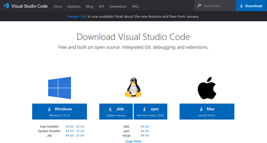

# Setting up VS Code and Extensions

## Overview

This lab covers all aspects of the download and installation of Visual Studio \(VS\) Code and the necessary prerequisites. This lab will cover the necessary steps and information to download and install the prerequisites needed for the subsequent labs within this course. This software is needed for one or more of the applications we will be utilizing in our labs throughout the course.

## Objectives

* Install node.js
* Install Java SDK
* Install and run Visual Studio Code
* Install Zowe Explorer plugin
* Install IBM Z Open Editor plugin
* Complete registration

## **Lab instructions**

### Install node.js:

1. Check for node.js installation and verify that the version number is v8 or higher.

Open your workstation's version of the command prompt \(called Terminal on Mac OS X\). Once the command prompt is open, use the command in Example 1 to check if your workstation currently has a version of node.js installed.

Node.js version

`C:\Users\User> node -v`

`V12.16.1`

If you do not see a version number after you submit the command, you do not have node.js installed, or if it shows a version less than v8, you should continue following these instructions. If you do see a version number and it is v8 or higher, you can move on to section Install Java SDK.

1. If node.js version is less than v8, or node isn't installed at all.

Updating node.js to the appropriate version number is a relatively simple process because the installer takes care of most of the "heavy lifting". All you will need to do is visit the Node.js download site, provided below, and follow the download and installation instructions for your specific workstation platform. Do this same process if you do not already have node.js installed.

[https://nodejs.org/en/download/](https://nodejs.org/en/download/)

This process will install the latest versions of Node.js and the node package manager \(npm\) and overwrite any older version files in your system. This removes the step of needing to manually uninstall the previous versions beforehand.

1. Once completed, verify the installation and proper version number, as shown previously in Example 1.

Note: The version numbers in our examples are provided purely for reference and may not reflect the latest versions of the software.

### Install Java SDK:

1. Check for Java installation and verify that the version number is v8 or higher.

Open your workstation's version of the command prompt, if not already open. Once the command prompt is open, use the command in Example 2 to check if your workstation currently has a version of Java installed. Java SDK 8 is the preferred version for these labs, however, any versions higher than that will suffice.

1. Java version

`C:\Users\User> java -version`

`java version "1.8.0_241"`

Java\(TM\) SE Runtime Environment \(build 1.8.0\_241-b07\)

Java HotSpot\(TM\) 64-Bit Server VM \(build 25.241-b07, mixed mode\)

If you do not see a version number after you submit the command, you do not have Java installed or if it shows a version less than v8, you should continue following these instructions. The display format of the version number for Java is slightly different than what is displayed for node.js. With Java, the second value in the displayed version number, i.e. the "8" in Example 2, is the version number. So, our example is showing Java SDK version 8. If you do see a version number and it is v8 or higher, you can move on to section Install VSCode.

1. If your version of Java displayed is less than v8, you need to uninstall the current version on your workstation and reinstall the correct version. Follow the link below to uninstall instructions that represent your workstation operating system \(OS\).

**Linux: https://www.java.com/en/download/help/linux\_uninstall.xml**

Mac: [https://www.java.com/en/download/help/mac\_uninstall\_java.xml](https://www.java.com/en/download/help/mac_uninstall_java.xml%20)

Windows: [https://www.java.com/en/download/help/uninstall\_java.xml](https://www.java.com/en/download/help/uninstall_java.xml%20)

1. Once Java is uninstalled from your workstation, you can click the Java JDK 8 download link below and follow the installation instructions for your specific OS.

[https://www.oracle.com/java/technologies/javase/javase-jdk8-downloads.html](https://www.oracle.com/java/technologies/javase/javase-jdk8-downloads.html)

1. Verify the installation and proper version number as shown in Example 2.

Note: You will be prompted to register a new Oracle account in order to download the installation file, please do so. If you have an existing account, you may use that to log in and continue.

## Install VSCode

If you do not already have VSCode installed on your workstation, please do so now by following the download and installation instructions at the link below:

[https://code.visualstudio.com/download](https://code.visualstudio.com/download)

Note: Be sure to select the correct installation file for your workstations respective OS, shown in Figure 1.

## Install VSCode extensions

This section introduces two VSCode extensions, Zowe Explorer and IBM Z Open Editor, listed in Figure 2, and instructions on how to install them.

### Zowe Explorer:

Zowe is a new, and the first open source framework for z/OS and provides solutions for development and operations teams to securely manage, control, script and develop on the mainframe like any other cloud platform. Out of the box, the Zowe Explorer provides a lot of functionality allowing z/OS developers access to jobs, datasets and \(USS\) files on a z/OS server. Backed by the Zowe CLI and z/OSMF, developers now have powerful features that makes it easy to work with z/OS within the familiar VSCode environment. This extension can be used to edit COBOL and PL/I files opened on z/OS MVS™ and USS using the Zowe extension's Data Sets and USS views. It can even run JCL and lets you browse job spool files. For more information on Zowe Explorer and its interaction with z/OS please visit:

https://ibm.github.io/zopeneditor-about/Docs/interact\_zos\_zowe\_explorer.html

### Install Zowe Explorer:

Open VSCode and in the left side tool menu select **Extensions**. From there, in the "Search Extensions in Marketplace" search field, type Zowe Explorer. Search results will begin populating, select **"Zowe Explorer"** and click **install**, depicted in Figure 3.

The Zowe community has a number of on-line videos that walk through the steps required to install, configure and operate the Zowe Explorer, see: [http://www.youtube.com/watch?v=G\_WCsFZIWt4&t=0m38s](http://www.youtube.com/watch?v=G_WCsFZIWt4&t=0m38s)

### IBM Z Open Editor:

IBM Z Open Editor brings COBOL and PL/I language support to Microsoft VSCode. It is one of the several next generation capabilities for an open development experience for z/OS®. It also works in association with the Zowe Explorer plugin. For more information on IBM Z Open Editor, please visit:

[https://ibm.github.io/zopeneditor-about/Docs/introduction.html\#key-capabilities](https://ibm.github.io/zopeneditor-about/Docs/introduction.html#key-capabilities)

### Install IBM Z Open Editor:

Open VSCode and in the left side tool menu select **Extensions**. From there, in the "Search Extensions in Marketplace" search field, type IBM Z Open Editor. Search results will begin populating, select **" IBM Z Open Editor "** and click **install**, depicted in Figure 4.

Note: There may be some limitations with IBM Z Open Editor if running a 32-bit Java version on Windows.

### Register for an account:

Follow the link provided below to register for an account with the mainframe. This account registration will provide you with a username, password and z/OSMF URL to establish your connection to the mainframe and must be done before moving on to lab 2.

### **Registration Link:**

[https://www-01.ibm.com/events/wwe/ast/mtm/cobolvscode.nsf/enrollall?openform](https://www-01.ibm.com/events/wwe/ast/mtm/cobolvscode.nsf/enrollall?openform)

## 

