# Exploring the User Interface

The key to being exceptionally productive in any development tool is being intimately familiar with the user interface, for the simple reason that the basic user interface will be the environment in which you spend the vast majority of your editing time. Yes, the quick key bindings are useful to know, as are the customizations and extensions that are available. But to be truly efficient in Visual Studio Code, you need to know the basic elements of the user interface and how they work together.

Figure 2-1 shows Visual Studio Code with a simple React app open. 


The basic user interface consists of four main areas, each marked in Figure 2-1 with a different letter:

* Activity Bar \(labeled “A”\)—Located on the left side of the screen, the Activity Bar provides a mechanism to switch between different views.
* Editors \(labeled “B”\)—This area contains the different editors that are open with Visual Studio Code. Each tab represents a different file, but it is possible to work on multiple files simultaneously, using a side‐by‐side or an above‐and‐below view.
* Side Bar \(labeled “C”\)—Contains different views of the workspace, such as the Explorer shown in Figure 2-1. It also acts as the launching point for working with source control, debugging your application, and interacting with any extensions you have installed.
* Status Bar \(labeled “D”\)—Displays information about the current active workspace and the files that are being edited.

## EDITORS <a id="head-2-3"></a>

Because Visual Studio Code is, at its heart, a text editor \(even granting the additional functionality provided\), it seems reasonable to start in that area.

The area reserved for the different editors takes up the bulk of the application's surface. It's on the right‐hand side of Figure 2-1 and the size at the top is indicated with the letter “B.” This space is where the editors for all the different files you open appear.

## ACTIVITY BAR <a id="head-2-4"></a>

On the left side \(by default\) of Visual Studio Code is the Activity Bar. It is the area marked “A” in [Figure 2-1](https://learning.oreilly.com/library/view/visual-studio-code/9781119588184/c02.xhtml#c02-fig-0001) and can be seen in more detail in Figure 2-2. 

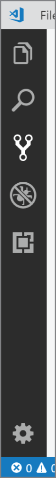

The icons are each used to access a pane that contains information useful to the editing and developing process. Six icons are available. The first five, starting from the top, are Explorer, Search, Source Control, Debug, and Extensions. At the bottom is an icon that is used to access the settings for Visual Studio Code.

The Settings icon is one of a couple ways to access the settings for Visual Studio Code. Clicking the icon displays a context menu, as shown in Figure 2-3. 

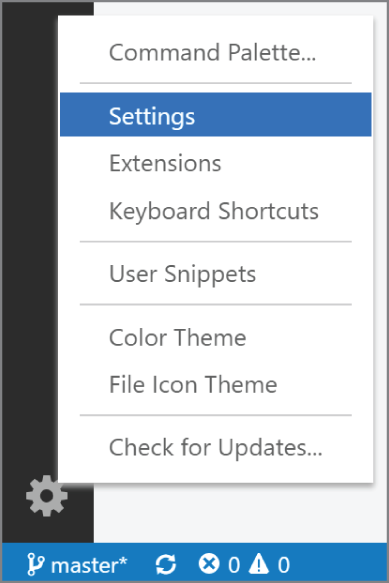

Clicking the Settings option \(highlighted in Figure 2-3\) opens the Settings editor \(Figure 2-4\). 


It's also possible to get to the Settings editor by using the File ➪ Preferences ➪ Settings menu option, or by using the Command Palette \(View ➪ Command Palette\) and entering **Preferences: Edit User Settings**.

Settings are scoped into two separate blocks: user settings and workspace settings. You can see these two scopes as tab headers immediately below the Search Settings text box. The list of possible settings is mostly the same for each scope. The difference then becomes where the settings are persisted, and which one takes precedence.

User settings are applied to any instance of Visual Studio Code that you open. Exactly where the user settings are stored depends on your platform. 

For Windows, the file is located at `%APPDATA%\Code\User\settings.json`. 

For macOS, the location is `$HOME/Library/Application Support/Code/User/settings.json`. 

And for Linux, the settings are at `$HOME/.config/Code/User/settings.json`.

Workplace settings are applied to the specific workspace that is being opened. This means that the settings \(also in a `settings.json` file\) are stored in the same folder as the workspace. This makes it easier for settings to be shared between team members by simply moving the settings along with the rest of the files and folders.

For the scope of the two groups of settings to be consistent with these definitions, any configuration value in the workplace settings overrides the same configuration in the user settings.

The settings are divided into a number of different categories. These categories appear in a tree navigation control on the left side of the Settings editor. Expanding any one of the categories displays a number of subcategories. When either a category or a subcategory is selected, the settings for that group are displayed at the right.

As well, and differently than many tree‐like navigations, you can move between different groups of settings by using the scroll bar on the right. As you scroll up and down, the category and subcategory on the left will change, so you can actually scroll through all of the setting items without going through the categories.

As a last navigation function through the settings, there is a Search Settings text box at the top of the Settings editor. As you type into the text box, the settings that match your text appear in the rest of the editor. See [Figure 2-5](https://learning.oreilly.com/library/view/visual-studio-code/9781119588184/c02.xhtml#c02-fig-0005) for an example of entering **Exc** into the text box. 


Notice that not only does the list of settings change based on the value in the text box, but so does the content of the categories on the left. If you expand the categories, you can see the number of settings in each of the categories that match the filter value.

### Editing Settings Manually <a id="head-3-3"></a>

Visual Studio Code provides two ways to edit settings. The first is through the user interface that was just described. But you can also edit the settings manually, and, for some of the settings, manually is the only option you have.

In the top right of the Settings pane, there is a pair of curly braces \(visible in Figure 2-4\). When you click them, the `settings.json` file for your current scope \(user or workspace\) is opened. Following is an example of what the file might look like:

```text
{
    "workbench.colorTheme": "Default Light+",
    "workbench.sideBar.location": "left",
    "editor.lineNumbers": "off",
    "files.useExperimentalFileWatcher": true,
    "workbench.useExperimentalGridLayout": true,
    "terminal.integrated.shell.windows": "C:\\Program Files\\Git\\bin\\bash.exe",
    "editor.autoIndent": false,
    "diffEditor.renderSideBySide": true
}
```

Each of the settings is a JSON attribute name combined with a value. The value can be a string, a Boolean, a number, or another JSON object. Because the settings are interpreted by either Visual Studio Code or an extension, it's up to the consumer to determine what the proper format is.

The attribute name is the fully qualified name of the settings. In general, the name is in the form of `target.setting`, where `target` is the component that will be using the setting and `setting` is the identifier for the setting.

The `settings.json` `file` is a text file, albeit one formatted as JSON. This means you are free to edit it as you wish. Make the changes you want, save the file, and the settings will be changed. If this seems a little free‐form for you, know that IntelliSense is available to help ensure that you don't make any typos. Defining settings that aren't used by any extension does not cause Visual Studio Code to break. So long as the file is in a valid JSON format, Visual Studio Code has no problem.

This book is going to approach the Settings options a little differently than the other icons on the Activity Bar. As has already been mentioned, a large number of settings are available and simply listing them and describing their functionality doesn't provide the appropriate context to their usage \(at least, not in a lot of cases\). So instead, you'll find information about the settings that are appropriate alongside the corresponding functional description. If you need to find a summarized list of the settings that are covered by the book, you can find them in the index.

## STATUS BAR <a id="head-2-5"></a>

Like pretty much every other application you've worked with, the Status Bar in Visual Studio Code appears at the bottom of the application, and it runs across the entire width of the application's screen. What makes this Status Bar just a little bit different is that, along with providing status information, it can also be used to make adjustments to the settings for the current file, or to interact with source control.

There are two ends to the Status Bar, each with a different focus. The left side of the status bar, shown in Figure 2-6, is the status for the source control and the open project as a whole. 

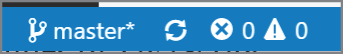

Four components are on the left side of the Status Bar. On the extreme left is the name of the current branch. In Figure 2-6, the project is on the master branch. The asterisk at the right of the branch name indicates that a change has been made to the current branch.

It's possible to initiate the process of changing branches from the Status Bar. Click the current branch and the text box and drop‐down shown in Figure 2-7 appears at the top of the Visual Studio Code interface. 

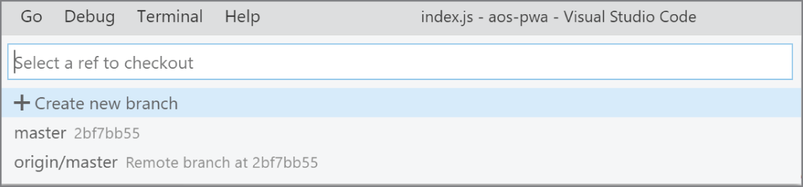

Here you have a number of options. You can just select the branch to which you would like to change. Clicking a branch automatically performs the checkout. Or, you can start typing the name of the desired branch into the text box. This filters the list of branches that appear in the list. Again, selecting one initiates the checkout process.

Finally, you can create a new branch by clicking the Create New Branch link. A different text box is displayed, indicating that you should provide the name of the new branch. Type the name of the new branch and press Enter to create the branch. A branch with the same name is also created on the remote server. If you want to terminate the creation at any point, use the Esc key to exit this process.

The second icon \(the circle of arrows in Figure 2-6\) is used to synchronize changes with a Git repository. This icon actually changes to represent the action that is triggered when the icon is clicked. When it's the circle of arrows, it is used to synchronize changes between the current branch and the remote repository associated with the branch. As changes in the project are made, the icon will also change. There is a cloud/arrow icon that is used to publish changes to the local repository.

The last two icons on the left side of the status bar \(the ones at the right of that group\) are used to indicate the errors and warnings that have been found within the project. The number of errors and warnings is indicated as a number to the right of the corresponding icons. When you click the icon \(either one\), the Problems window is displayed. 

The group of icons on the right side of the Status Bar \(shown in Figure 2-8\) are focused on information and settings related to the current editor. 


Starting from the left is the current position of the cursor, both the row and the column. If there is an active selection in the editor, the number of characters \(even across rows\) is displayed. If you click this information, a text box opens at the top of Visual Studio Code \(see [Figure 2-9](https://learning.oreilly.com/library/view/visual-studio-code/9781119588184/c02.xhtml#c02-fig-0009)\) that allows you to enter a line number and go directly to that line. Ctrl+G opens the same text box. 

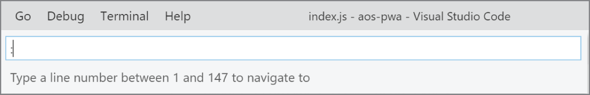

The next piece of information relates to code indentation within the editor. In Figure 2-8 each indentation consists of four spaces. However, you can change and configure this in a number of different ways. Clicking the value causes the panel shown in Figure 2-10 to appear at the top of the window. 

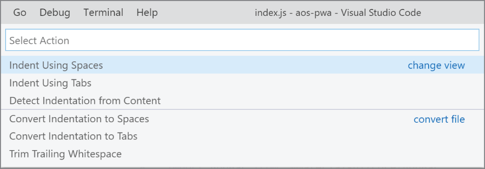

In the top half of Figure 2-10, three options are available for indentation. Spaces can be used, which is the current setting for this file. Tabs can be used, by selecting that option. Or the characters used for indentation can be detected by examining the content. If your preference is to use spaces, clicking the Change View link at the right enables you to change the number of spaces.

Changing the number of spaces impacts the positioning of the indentation lines \(the vertical lines seen in Figure 2-11\). However, it does not change the positioning of code that had previously been created using a different indentation point. 

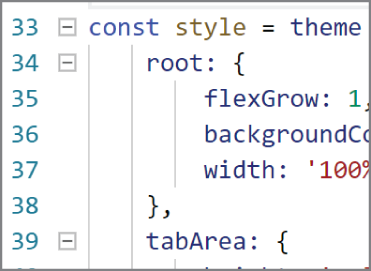

The lower half of the pane is used to convert from space‐based indentation to tab‐based and back again. Clicking the top line \(Convert Indentation To Spaces\) will convert from tabs to spaces. Clicking the second line converts in the opposite direction, making each indentation tab the previously specified number of spaces. The bottom option has nothing to do with the indentation but will remove any extra spaces from the end of the lines in the file.

The next setting in this Status Bar group relates to the encoding for the current file. In Figure 2-8, the current setting is UTF‐8. Clicking this item provides two options: you can save the file using a different encoding or you can reopen the file with a different encoding. Regardless of which choice you make, the next option is to select the desired encoding from a fairly long set of possibilities.

The next option \(seen as CRLF in Figure 2-8\) is the character sequence that appears at the end of each line. CRLF means that the line is terminated by a carriage return and a line feed. The other option, available if you click the setting, is to just have the line terminated by a line feed.

Next to the encoding option is the language being used in the current editor. By default, this is determined by using the extension on the file. However, by clicking this option, a pane appears \(shown in Figure 2-12\) that enables you to affect this value. 

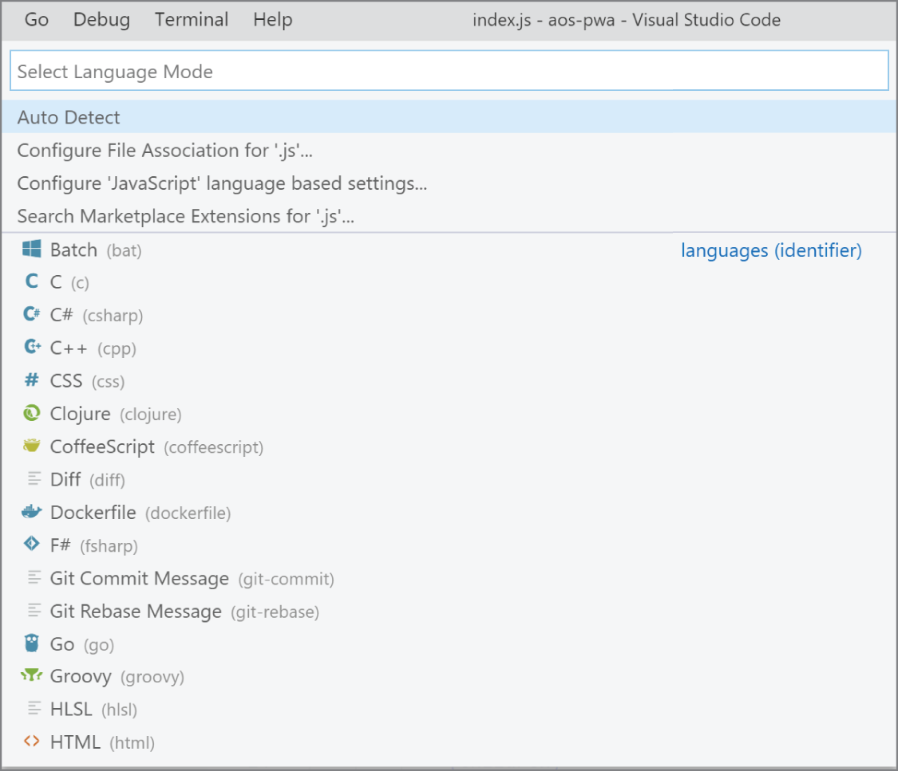

The bulk of the pane in Figure 2-12 is taken up with a list of the languages that are supported by Visual Studio Code. You can choose the language being used by simply selecting it.

A couple of other options are available to you, however. The first item, Auto Detect, will use the known information about the various languages in an attempt to determine what language is in the current editor.

The second choice, Configure File Association For .js, is used to modify the language that Visual Studio Code associates with this file extension. Choosing this option displays a list of languages, allowing you to select the one that will be chosen for future files with the same extension.

The next choice, the option labeled Configure ‘JavaScript’ Language Based Settings, is used to customize how the JavaScript language is processed within Visual Studio Code. Making this choice opens up the settings file for Visual Studio Code in a new editor. You can then manually add settings to this file and save them to have them take effect. The specific settings are dependent on the language involved.

The last two icons are used to get and send feedback about Visual Studio Code. The happy face icon opens up a window \(shown in Figure 2-13\) that can be used to tweet a message describing your thoughts.

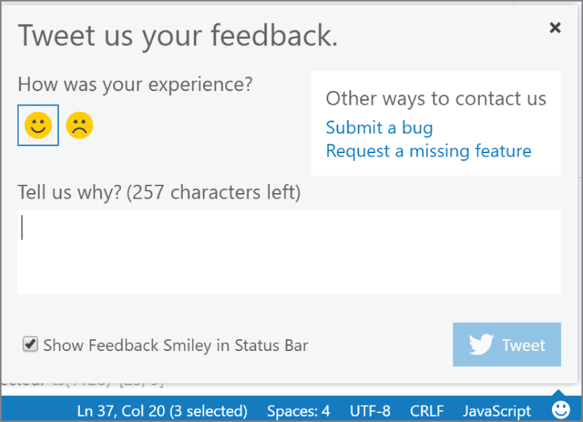

Although sending a tweet is nice, the feedback pane also includes a couple of links to provide specific information to the development team. The Submit A Bug link triggers the form shown in Figure 2-14. 


Here, you can choose the type of feedback \(bug, feature request, or performance issue\) and the target of the feedback \(either Visual Studio Code itself or an extension\). In addition, you will be asked for a title and a set of steps that will reproduce the bug or issue. Once the information has been provided, clicking Preview On GitHub causes this information to be transferred to GitHub.

Why GitHub, you ask? Because Visual Studio Code is an open‐source project, and the source code is hosted on GitHub. So your feedback will, if you approve it, become an issue raised against that project.

The final icon at the extreme right of Figure 2-8 \(the bell\) is used to view any notifications that have been raised from within Visual Studio. These are not notifications associated with the project that you're working on, but more application‐level notices, such as when a new version is available. Clicking the icon displays the list and enables you to view and respond to the notifications as appropriate.

## OTHER WINDOWS <a id="head-2-6"></a>

To this point, we've looked at the surface of Visual Studio Code as it's presented upon opening. This section discusses other windows that are quite useful and only a couple of keystrokes or clicks away.

### Command Palette <a id="head-3-4"></a>

One of the keys to be able to stay “in the flow” is to avoid removing your hands from the keyboard. To assist in getting to the various commands that are available in Visual Studio Code, you have the Command Palette at your disposal. Figure 2-15 shows the Command Palette at the top of the IDE. 

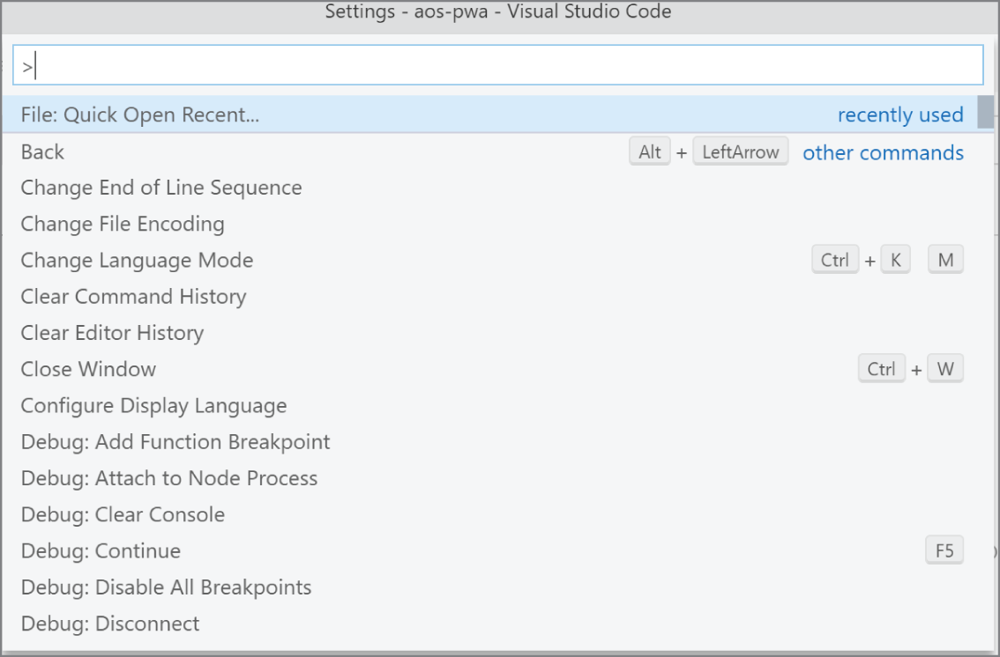

The Command Palette is activated through a number of different keystrokes. Keeping with the “in the flow” theme, you can launch it using Ctrl‐Shift+P \(Cmd+Shift+P in macOS\) or F1. Those keyboard shortcuts are configurable in case you'd prefer a different combination. You can also open the palette through the View ➪ Command Palette menu option.

The purpose of the palette is to give you access to all of the Visual Studio Code commands. As you can see from Figure 2-15, a list of all of the available commands is visible. For those commands that are associated with keyboard shortcuts, the corresponding shortcut appears to the right of the command.

As you type into the text box at the top, the list of commands is modified to indicate those that match that content. Through a setting \(Workbench: Keyboard Navigation\), you have the ability to control how the matching commands are revealed. This setting is actually used to control how text‐based searches are revealed for all of the lists and trees in Visual Studio Code. Three options are available:

* Simple—As you type, the items in the list that match the accumulated keystrokes become focused. Matching is only done by the beginning of the item. In other words, the keystrokes ‘work’ would match ‘workspace’, but not ‘network’.
* Highlight—As you type, the items in the list that match the accumulated keystrokes become highlighted. You can see the additional matching items by using the scroll bar to move up and down the list.
* Filter—As you type, all of the elements that don't match the accumulated keystrokes are filtered out of the list.

At the very top of the list are the commands that you have most recently used. The idea is that, over time, your favorite commands will remain within reach with a minimum number of keystrokes. You can control the number of recent commands that are kept through the Workbench: CommandPaletteHistory command. This value is just a number indicating how much history to persist. The history of commands spans executions of Visual Studio Code. If you would rather not keep any commands, set this value to 0.

### Terminal Window <a id="head-3-5"></a>

For many different project types, being able to execute commands from the command line is critical to functionality and productivity. A Terminal window is built into Visual Studio Code to help with this process \(see Figure 2-16\). You can launch the window using Ctrl+\` \(that's the backtick character\), the View ➪ Terminal menu option, or the View: Toggle Integrated Terminal command from the Command Palette.

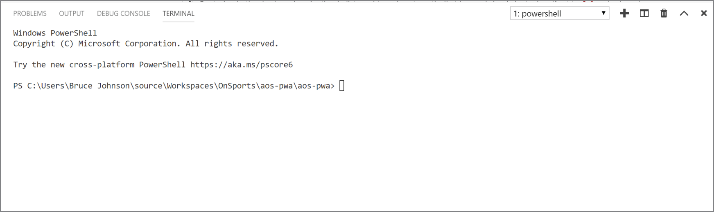

When the Terminal window is launched, the current directory is your current folder. The actual shell that is running depends on your platform. For macOS and Linux, the default is **$SHELL**. For Windows 10 it's PowerShell. For earlier versions of Windows, it's **cmd.exe**.

However, you can change the shell that gets launched at any time through the settings. Start by launching the Command Palette \(Ctrl+Shift+P\). Then enter **shell** into the text box. Select Terminal: Select Default Shell and a list of the shells for your platform appears \(see Figure 2-17\). Select the shell you want, and that shell becomes the one opened the next time you open a terminal. 

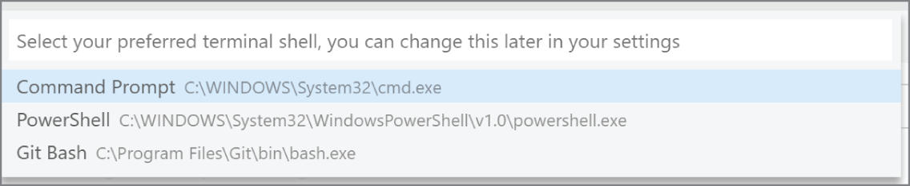

It's possible to have more than one Terminal session running simultaneously. In Figure 2-16, toward the top right, there is a drop‐down list. This list contains the different shells that you are currently running. Immediately to the right, there is a plus icon. Click that icon and you launch another shell \(the shell that you have specified as the default\). You can move from one shell to any of the others by using the drop‐down.

If you want to look at two Terminal sessions side‐by‐side, click the two‐panel icon to the right of the plus. This creates another Terminal session, but next to the current one \(see Figure 2-18\). 

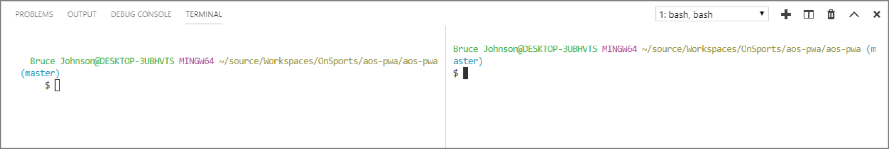

The garbage can icon is used to kill the current Terminal session. If you kill the last terminal session, the Terminal tab is closed.

A number of settings can be used to configure your Terminal window. For each of the different platforms, you can configure the path to the shell that will be executed \(Terminal ➪ Integrated ➪ Shell: Linux, Terminal ➪ Integrated ➪ Shell: Osx, and Terminal ➪ Integrated ➪ Shell: Windows\). You can specify parameters that are included when the shell is executed \(Terminal ➪ Integrated ➪ Shell Args: Linux/Osx/Windows\), and, in one of the most useful settings, you can specify the initial working directory for the shell \(Terminal ➪ Integrated: Cwd\). This is particularly useful if the root directory for your folder is not convenient for the commands that you want to execute.

### Output Window <a id="head-3-6"></a>

Messages from various parts of Visual Studio Code are directed to the Output window \(see Figure 2-19\). You can get to this window using the View ➪ Output menu option. 

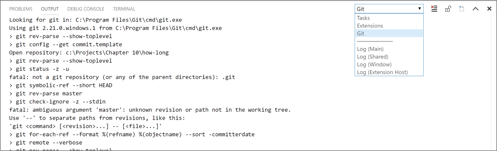

Functionally, the Output window is not particularly complex. Its job is to display output from the different processes that are running from within Visual Studio Code. In Figure 2-19, you can see a drop‐down toward the top right of the window. This contains a list of all of the potential sources for output. To see the output for a source, select it in that drop‐down. In Figure 2-19, the output is from Git.

To the right of that drop‐down are a couple of useful icons. The first icon to the right \(lines with an X in the top corner\) is used to clear the Output window for the current source. This allows you to be able to focus on the output that is important to you.

The next icon \(the lock\) is very useful if the selected source generates frequent output. Whenever a source produces output, it is added to the bottom of the screen. When there is too much output, a scroll bar appears. All of this is pretty typical behavior. However, if you scroll back up through the output looking for something and the source generates another line, the text flicks back down to the bottom. This can be quite annoying if you're looking for that crucial message. When you click the lock icon, you freeze the window at your scroll point. This means that when a line gets added to the bottom, your current scroll point is not changed. The output remains stable and you can find that important message a lot easier.

The third icon \(the document with the arrow\) is not enabled for all sources. In fact, it's enabled only when one of the Log sources \(at the bottom of the drop‐down list in Figure 2-19\) is selected. These logs are actually windows into the log files generated by different parts of Visual Studio Code. While they are visible in the Output Window, they are actually physical files on the file system. Clicking the icon causes the physical file to be opened in an editor.

### Debug Console <a id="head-3-7"></a>

The Debug Console \(Figure 2-20\) is quite similar in functionality to the Output window. 

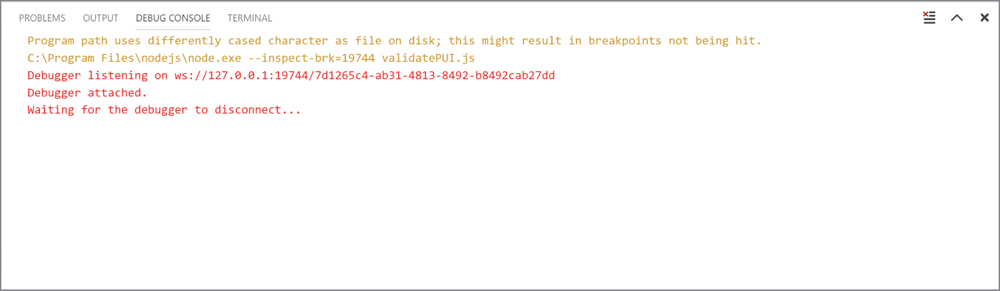

The difference between the two is that while the Output window is a view into different sources, the Debug Console only has a single source: the debugger.

The content of this window is generated while you are debugging your application. So all the messages generated by the debugger are sent to the Debug Console. As well, if your application directs messages to the debug output \(by using the `console.log` method in JavaScript, for example\), those messages also appear in the Debug Console.

In terms of control you have over the contents, there is an icon in the top right of the window \(the lines with the X\) that when clicked clears the contents of the window.

### Problems Window <a id="head-3-8"></a>

The Problems window \(Figure 2-21\) lists all the errors and warnings currently found in your project. 

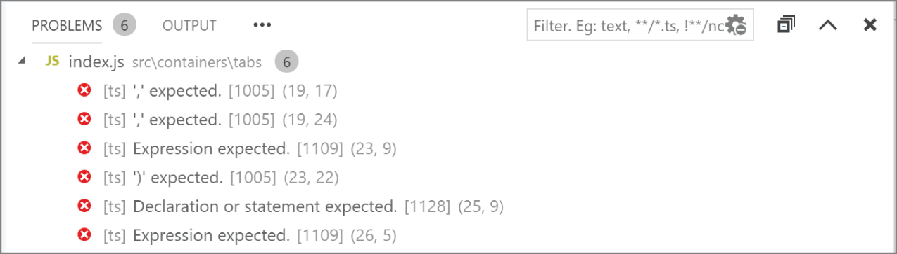

The display is in a hierarchical format. At the top of each tree is the file in which the errors or warnings are found. Then, below that node is a list of the errors and warnings, including the line and character position where they are. Double‐clicking any of the items will open the editor for that file and position the cursor onto that line.

At the right side of the top bar in Figure 2-21 are a couple of other controls that can be useful when you have a lot of errors and warnings to sift through. First, there is a filter text box. Enter some text and only those errors and warnings that contain the text will appear in the window. There is also a gear button on the right side of the text box. This provides an automatic filter based on the Files: Exclude setting.

This setting controls which files appear in the Explorer tree. More specifically, it is a collection of glob patterns, which define the files and folders that are not to appear in the Explorer. The setting also is used to restrict which files or folders appear in the results when searching. For instance, you might not want to search through the files in the `node_modules` directory, because it contains third‐party code. You can include a pattern in the Files: Exclude setting \(see the example in the following section\) and none of those files will be put into the search results.

Here are a couple glob examples to give you an idea of some common patterns:

* `**/.git`—Matches the file named `.git` anyplace in the hierarchy for the current folders.
* `**/node_modules/*/**`—Matches all files underneath the `node_modules` directory found anyplace in the hierarchy for the current folders.

Also on the right of the Problems window shown in Figure 2-21, there is an icon \(immediately to the right of the filter text box\) that is used to collapse all of the errors and warnings so that only the list of files is visible.

A couple of other indicators within Visual Studio Code alert you when there are problems within your project. Figure 2-22 illustrates the Project view and Outline view when there are errors. 

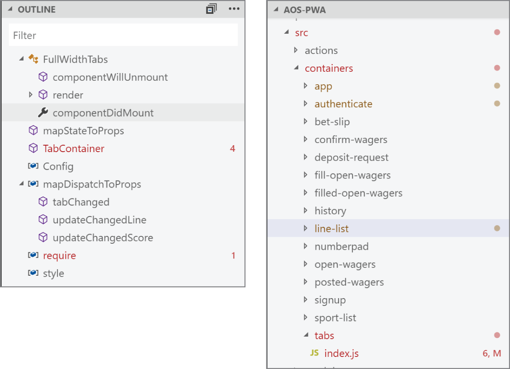

The screen on the left of Figure 2-22 is the Outline view. In this view, you can see that TabContainer has four errors and the require method has one. While it might not be obvious in the black and white image, the names TabContainer and require are in red, along with the number of errors.

The screen on the right of Figure 2-22 is the Project view. At the bottom, you can see that index.js has six errors. The M indicates that the file has been modified but not saved. The index.js name is also in red. But, along with the name of the file, the names of its parent directories are also labeled in red. So both tabs and containers will be in red. This allows you to see where any errors are even if the tree has not been fully expanded.

## SUMMARY <a id="head-2-8"></a>

It should be apparent that the workspace is the focal point of the development experience. While most of your time might be spent in the editor, the workspace is the glue that holds all of the features together. In this section, you were introduced to the main features of the workspace and how those features can be customized.

